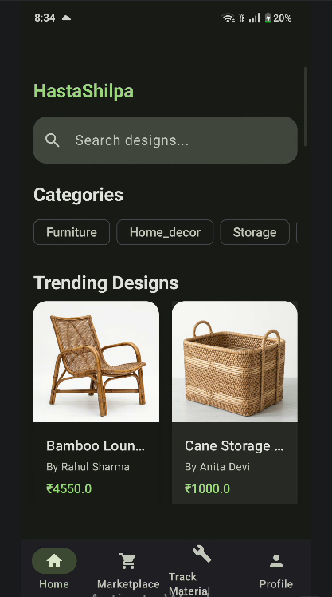
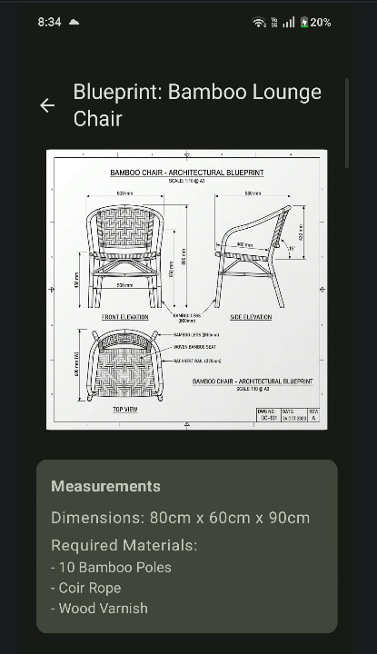
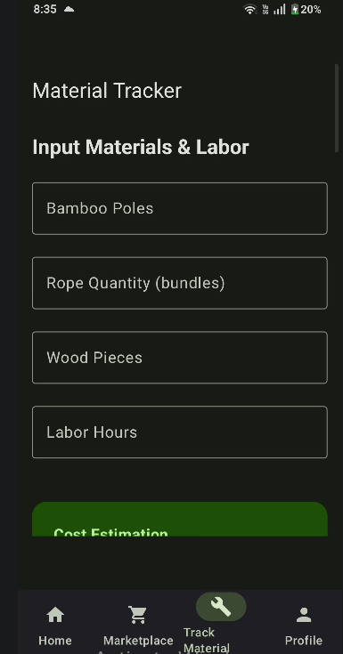

# Hasta-Shilpa

## Project Description
Hasta-Shilpa is a comprehensive Android application designed specifically for bamboo and cane artisans. Acting as a "Design Bridge for Artisans", the app empowers craftsmen by providing them with modern tools to enhance their traditional workflows. It solves the problem of bridging the gap between traditional craftsmanship and modern design planning, material tracking, and business management. The app is tailored for artisans who want to discover new designs, view detailed blueprints, track materials, calculate prices, and showcase their products in a digital marketplace. It also features Kannada language support to ensure accessibility for local artisans.

## Features
- **Design Discovery**: Browse a catalog of bamboo and cane furniture designs.
- **Blueprint Viewing**: Access detailed technical sketches with measurements for each product.
- **Material Tracking**: Keep track of required materials for different projects.
- **Price Calculation**: Tools to help calculate the cost and selling price of crafted items.
- **Marketplace**: Showcase finished products to potential buyers.
- **Localization**: Full Kannada language support for better accessibility.
- **Search Functionality**: Efficiently search through the product catalog.

## Technologies Used
- Kotlin
- Jetpack Compose (UI)
- Material Design 3
- MVVM Architecture
- Navigation Compose
- ViewModel
- Coil (Image Loading)

## Setup Instructions
To install and run the Hasta-Shilpa application locally, follow these steps:

1. Clone the repository:
   ```bash
   git clone <repository-url>
   ```
2. Open the project in **Android Studio**.
3. Let Gradle sync the project and download required dependencies.
4. Connect an Android device or start an emulator.
5. Click the "Run" button in Android Studio (or press `Shift + F10`) to build, install, and run the app on your device/emulator.

## Screenshots / Demo


| Home Screen | Blueprint Viewer | Material Tracker |
|---|---|---|
|  |  |  |
